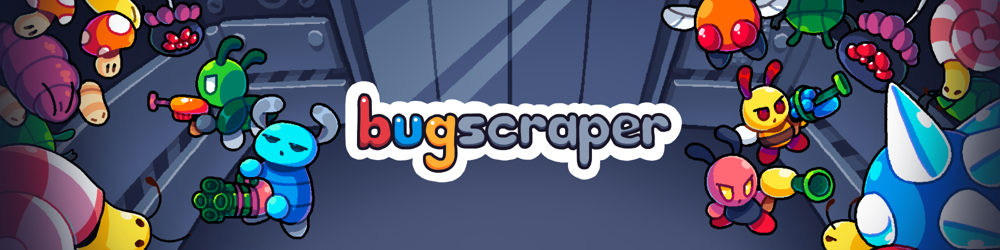

<!-- **NOTE:** if you are just here to obtain a free copy of the game, fair enough, but please consider supporting me by [buying the game](https://bugscraper.net) when you can, or at least sharing the game with other people. Thanks! 🙂
  -->

[**Website**](https://bugscraper.net) ·
[**Steam**](https://s.team/a/2957130) ·
[**itch.io**](https://yolwoocle.itch.io/bugscraper) ·
[**GitHub**](https://github.com/yolwoocle/bugscraper) 

Welcome to the bugscraper.

* 🐜 In this roguelike shooter, you take the role of employees of a bug-filled skyscraper fed up with their jobs.  
* 🐛 You will battle waves of enemies in an elevator as they come for your exoskeleton on every floor.  
* 🐝 Using a wide variety of weapons and upgrades, eliminate them and prepare to battle for the next floor!  
* 🐞 Play in solo, or with up to 4 friends in local co-op multiplayer. 

  🐞🐞🐞🐞🐞

  

## Is this game open source?
**This game is _NOT_ [open source](https://en.wikipedia.org/wiki/Open-source_software)**, rather it is [source available](https://en.wikipedia.org/wiki/Source-available_software). Some of the assets I use are incompatible with a traditional open-source licence. **Not having a licence means that by default I reserve all original rights for the game, even if the code is public.**  

However, this is moreso to legally cover my ass from abusers. I am very lax with what you can do with the source code. Please feel free to reuse, modify, fork or remix it for any non-commercial project. Please do not directly distribute any executables. Please note that I reserve the right to act accordingly if I see any abuse. 

If it does not fit that description please [contact me first](https://yolwoocle.com/about). I don't bite! :)

  🐛🐛🐛🐛🐛

  

## Running
To run the game, please follow the instructions on the [LÖVE Getting started page](https://love2d.org/wiki/Getting_Started).   
To export the game, look at the [LÖVE wiki page](https://love2d.org/wiki/Game_Distribution) on the subject.

  🐜🐜🐜🐜🐜

  

## Contributing

Please note that I was in highschool when I began this project. I am basically the only maintainer and I did not always plan for the future or make the best code design choices. The code is almost not documented and there are many, many, many things I would do differently if I were to start from scratch. You have been warned. 

For any questions you can [contact me](https://yolwoocle.com/about), by email (`leo@yolwoocle.com`) or on Discord (`@yolwoocle`) preferably.

  🐝🐝🐝🐝🐝

  
